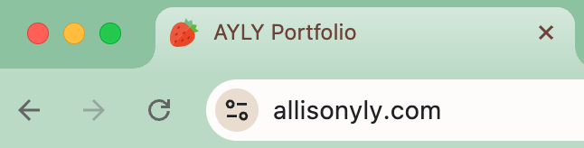
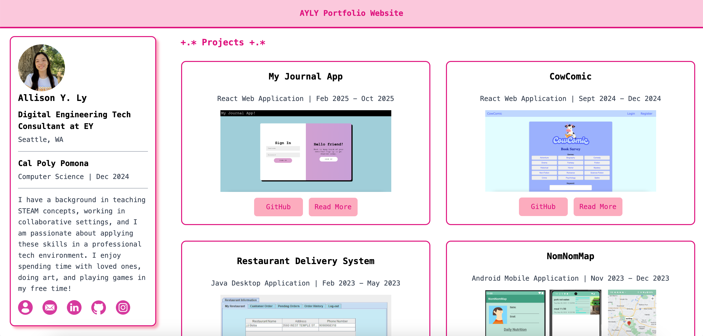
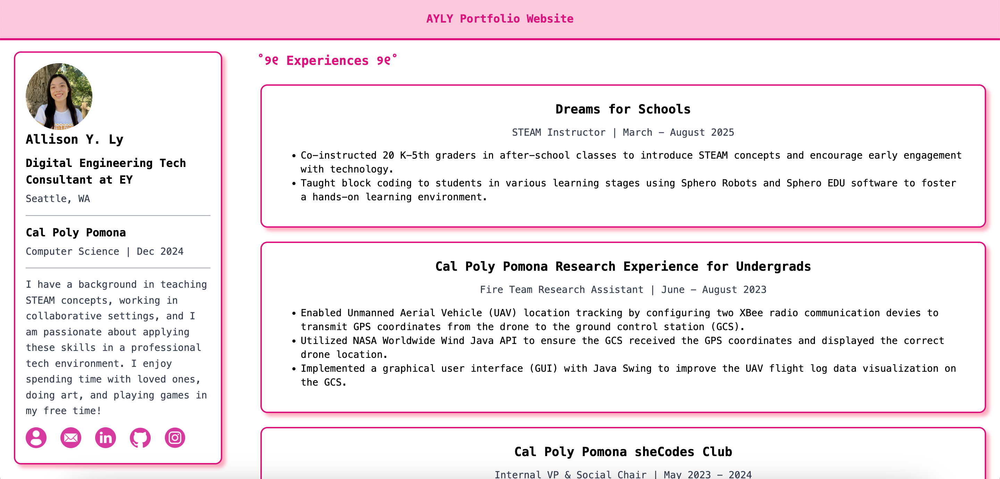

# :strawberry: Portfolio Website :strawberry: 
Welcome to my portfolio, this is a react web application that was made to showcase all of my projects and experiences in one place!

## :computer: Links
- ### [Website](https://www.allisonyly.com/)
- ### [2026 Demo Video](https://youtu.be/rPJ0ObnqA6Y)
- ### [2024 Demo Video](https://www.youtube.com/watch?v=rIeoBzPjRLY)
- ### [Figma](https://www.figma.com/design/X6lyEwL2FQsYY5sssEnDbw/Ally-Website?node-id=0-1&t=9Bw4IdA9UoJKmuYu-1)

## :gear: Tools/Resources
- React JS
- HTML/CSS
- Javascript
- Tailwind CSS
- Visual Studio Code
- GitHub
- Squarespace
- Figma
- Flaticon

## :camera: Website Features
1. Custom domain name (Squarespace) and tab icon (Flaticon)

   
2. One page website, About Me section stays showing on the left-side, scroll to see Projects and Experiences

   

   
