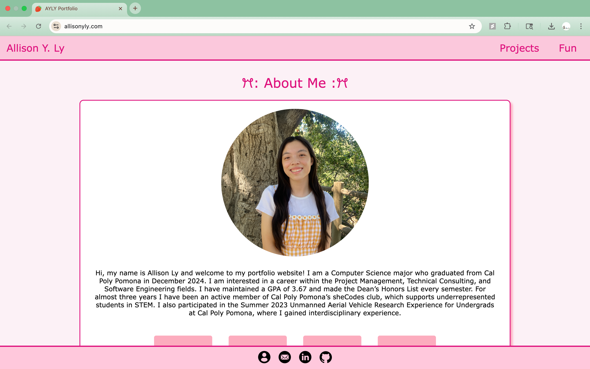
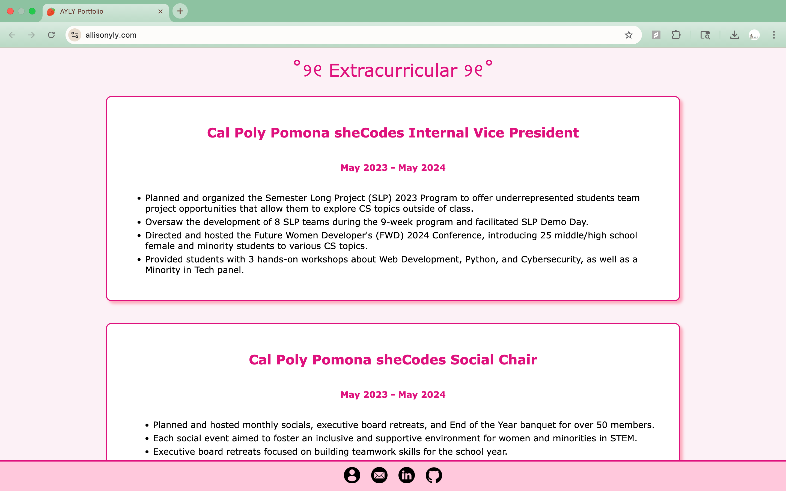
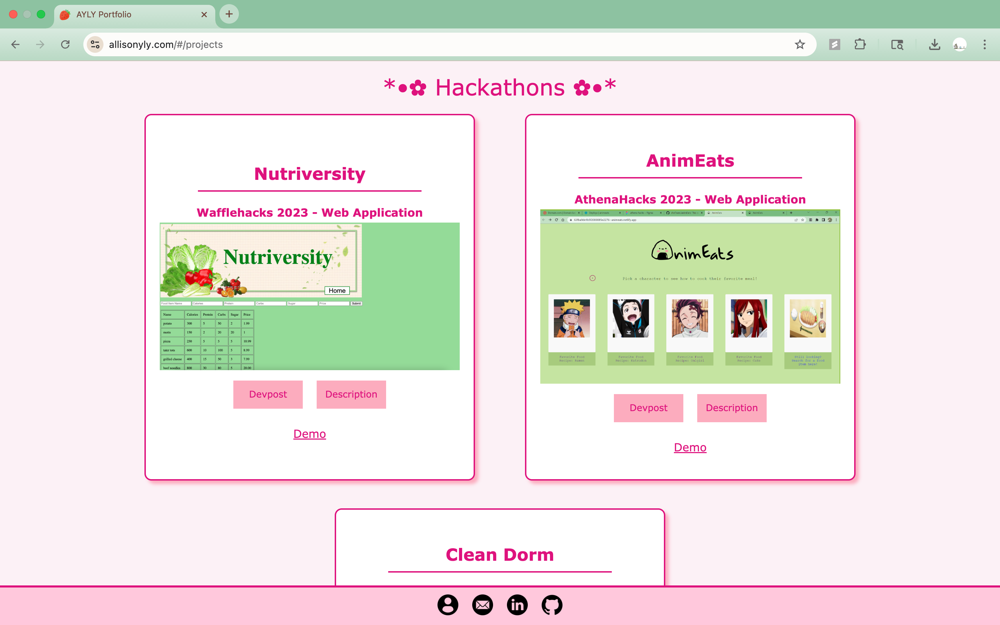

# :strawberry: Portfolio Website :strawberry: 
Welcome to my portfolio, this is a react web application that was made to showcase all of my experiences, projects, and artwork in one place!

## :computer: Links
- ### [Website](https://www.allisonyly.com/)
- ### [Demo Video](https://www.youtube.com/watch?v=rIeoBzPjRLY)
- ### [Figma](https://www.figma.com/design/X6lyEwL2FQsYY5sssEnDbw/Ally-Website?node-id=0-1&t=9Bw4IdA9UoJKmuYu-1)

## :gear: Tools/Resources
- React JS
- HTML/CSS
- Javascript
- Visual Studio Code
- GitHub
- Squarespace
- Figma
- Flaticon

## :camera: Website Features
1. Custom domain name (Squarespace) and tab icon (Flaticon)

   
2. "See More" Section: at the bottom of each page, as an alternative way to navigate to the other pages of the website
3. Three pages: Home, Projects, Fun
   
   ### Home Page
      - About Me: introduces who I am and links to resume and socials (email, Linkedin, Github)
        
      - Featured Projects: 3 projects are displayed as a linked image, which directs user to the specific project for more details
      - Work Experience and Extracirricular: has detailed explanations of my accomplishments
        
        
  
   ### Projects Page
      - Projects and Hackathons: showcases some of the projects I have worked on
        

   ### Fun Page
      - Anime Fanart: showcases some of my anime fanart that I have done
